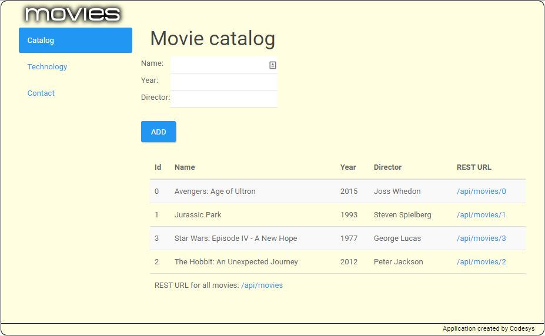

# movieapp
A simple movie cataloging application

## Demo 
Live demo of the application is available at [https://movieapp-pilvi.rhcloud.com/index.jsf](https://movieapp-pilvi.rhcloud.com/index.jsf)  
(If it doesn't respond please wait a min and retry)

    
## Java EE techniques
- EJB 3.2
- JSF 2.2
- CDI 1.1
- Bean validation
- JPA 2.1
- JAX-RS 2.0

## Tools
- Wildfly 8.2
- Maven
- H2 in-memory DB
